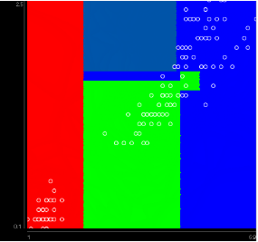
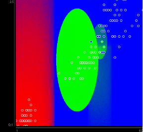

# Bivariate Hyperspheres implementation in WEKA
Requirements: 
    Java v17 or Higher

Instead of the traditional hyperplane/hyperrectangle created by most decision tree algorithms, this implements circular splits instead.
NOTE: There is not much practical applications for this algorithm, in cases where a circular split needs to be considered, a KD-Tree/Ball tree should be considered instead.

To reduce the search space for each circular splits radius, the only split considered is $(r_{max} - r_{min})/2$ where $r_{max}$ is the radius of the largest radius that yeilds the subset of the considered instances, and $r_{min}$ is the smallest radius that yeilds the same subset.
The best split among attribute pairs and associated candidate circles is chosen via information gain.

This can be compiled using the command: `javac -cp "java;weka.jar" java/weka/classifiers/trees/*.java`
To run: `weka.ps1` (Windows) or `weka.sh` (Unix-like)

In WEKA configure weka.classifiers.trees.ClassificationTree ensuring bivariate is set to true

Boundry Visualiser Example:
C4.5 (Standard Decision Tree Example)

This algorithm:
